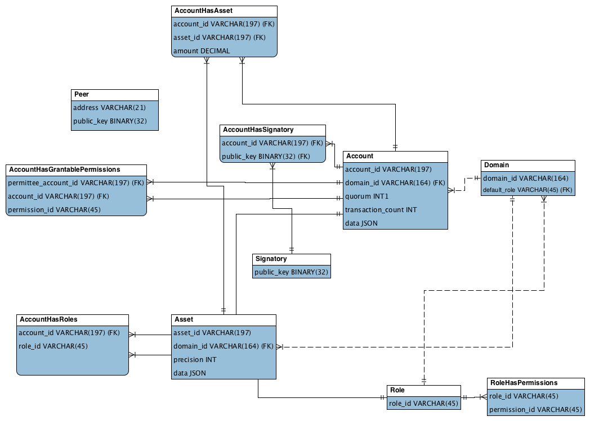

# Entity-relationship model

This section describes the contents of World State View, or in other words — the state of entities as per the latest block in the chain.

## Peer

 * address — network address and internal port, is used for synchronization, consensus, and communication with the ordering service
 * public_key — key, which will be used for signing blocks during consensus process

## Asset

 * asset_id — identifier of asset, formatted as asset_name#domain_id
 * domain_id — identifier of domain, where the asset was created, references existing domain
 * precision — size of fractional part
 * data — JSON with arbitrary structure of asset description

## Signatory

* public_key — a public key

## Domain

* domain_id — identifier of a domain
* default_role — a default role per user created in the domain, references existing role

## Role

* role_id — identifier of role

### RoleHasPermissions

* role_id — identifier of role, references existing role
* permission_id — an id of predefined role

## Account

* account_id — identifier of account, formatted as account_name@domain_id
* domain_id — identifier of domain where the account was created, references existing domain 
* quorum — number of signatories required for creation of valid transaction from this account
* transaction_count – counter of transactions created by this account
* data — key-value storage for any information, related to the account

### AccountHasSignatory

* account_id — identifier of account, references existing account 
* public_key — a public key (which is also called signatory), references existing signatory

### AccountHasAsset

* account_id — identifier of account, references existing account 
* asset_id — identifier of asset, references existing asset
* amount — an amount of the asset, belonging to the account

### AccountHasRoles

* account_id — identifier of account, references existing account 
* role_id — identifier of role, references existing role

### AccountHasGrantablePermissions

* account_id — identifier of account, references existing account. This account gives grantable permission to perform operation over itself to permittee.
* permittee_account_id — identifier of account, references existing account. This account is given permission to perform operation over account_id.
* permission_id — identifier of grantable_permission